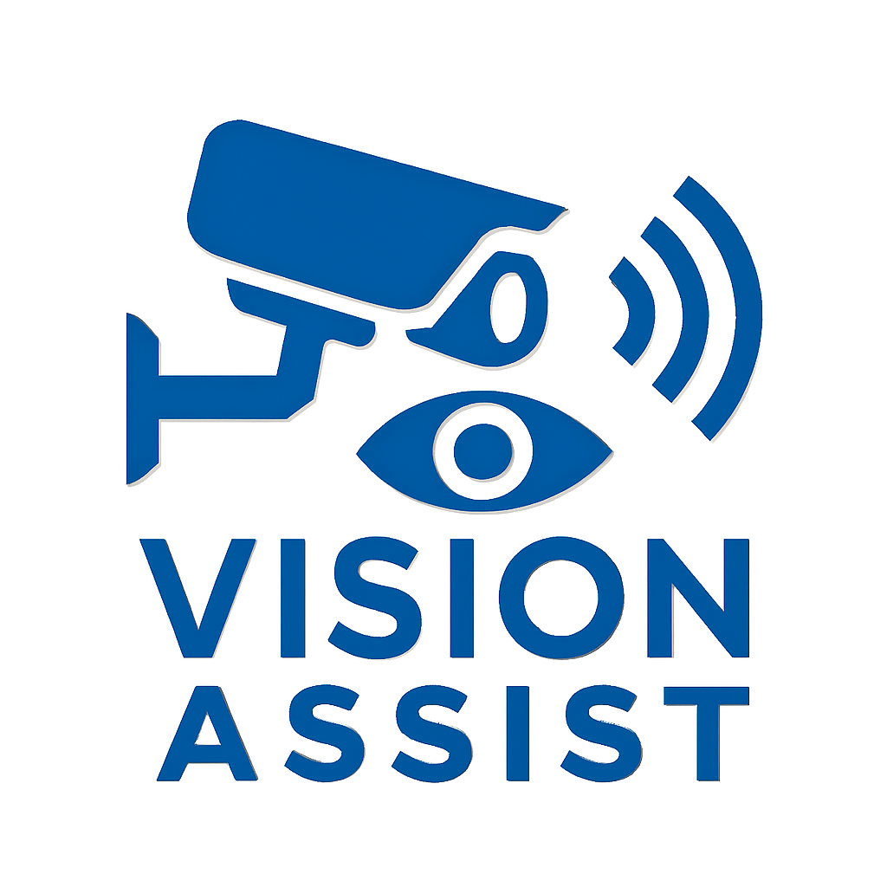

<div align="center">
  

  <h1>SmartVision</h1>

  <p>
    A real-time intelligent vision system that uses YOLOv8, OpenCV, and Flask to detect indoor objects, estimate distance, and provide browser-based visual feedback.
  </p>

  <p>
    
    
    
    
    
  </p>

  <p>
    <a href="#project-overview">Overview</a>
    |
    <a href="#features">Features</a>
    |
    <a href="#installation">Installation</a>
    |
    <a href="#usage">Usage</a>
    |
    <a href="#contact-information">Contact</a>
  </p>
</div>

---

## Project Overview

SmartVision is a seminar project focused on assistive real-time computer vision. The application captures a webcam feed, runs YOLOv8 object detection, estimates the distance of detected objects using known object dimensions and calibrated focal length, and streams the annotated video feed to a clean browser interface.

The system is designed to help users understand nearby indoor objects such as chairs, sofas, and tables. It also exposes lightweight API endpoints for current detection status and announcement text, making it suitable for future accessibility features such as voice feedback.

## Features

- Real-time webcam object detection powered by YOLOv8.
- Live annotated video stream served through Flask.
- Distance estimation for detected objects using bounding-box dimensions.
- Closest-object tracking with current distance display.
- Audio announcement queue logic for stable object notifications.
- Browser-based dashboard with responsive Tailwind CSS styling.
- Indoor object dataset in YOLOv8 format.
- Calibration image collection for future camera-distance tuning.
- Clean project structure ready for GitHub collaboration.

## Tech Stack

| Category | Technologies |
| --- | --- |
| Language | Python |
| Backend | Flask |
| Computer Vision | OpenCV, Ultralytics YOLOv8 |
| Machine Learning | YOLOv8 model weights, YOLO-format dataset |
| Frontend | HTML, Tailwind CSS, JavaScript |
| Data | Roboflow indoor object dataset |
| Runtime | Local webcam, browser-based stream |

## Installation

### Prerequisites

- Python 3.10 or newer
- Git
- A working webcam
- Windows is recommended for the current local setup

### Setup

Clone the repository:

```powershell
git clone https://github.com/Xid03/SmartVision.git
cd SmartVision
```

Create and activate a virtual environment:

```powershell
python -m venv .venv
.venv\Scripts\activate
```

Install the required packages:

```powershell
pip install flask opencv-python ultralytics numpy comtypes
```

Verify that the model file exists:

```powershell
dir yolov8s.pt
```

The application currently loads the model from:

```python
MODEL_PATH = "yolov8s.pt"
```

To use a custom trained model, update `MODEL_PATH` in `app.py`, for example:

```python
MODEL_PATH = "runs/detect/train/weights/best.pt"
```

## Usage

Run the Flask application:

```powershell
python app.py
```

Open the app in your browser:

```text
http://localhost:5000
```

Available routes:

| Route | Description |
| --- | --- |
| `/` | Main SmartVision dashboard |
| `/video_feed` | Live MJPEG video stream with detections |
| `/get_status` | JSON endpoint for FPS, closest object, and distance |
| `/get_announcement` | JSON endpoint for the latest generated announcement |

## Screenshots

Add screenshots to `docs/screenshots/` and reference them here for the best GitHub presentation.

| Dashboard | Detection Stream |
| --- | --- |
| `docs/screenshots/dashboard.png` | `docs/screenshots/detection-stream.png` |

Suggested screenshots:

- Main dashboard view.
- Live detection result with bounding boxes.
- Status cards showing FPS, closest object, and distance.
- Example object-distance announcement.

## Demo

A demo video can be added to the repository or linked from YouTube, Google Drive, or a GitHub release.

Recommended demo flow:

1. Launch the Flask server.
2. Open the dashboard at `http://localhost:5000`.
3. Show live object detection from the webcam.
4. Demonstrate closest-object distance estimation.
5. Show the status and announcement updates.

## Folder Structure

```text
SmartVision/
|-- app.py                    # Main Flask application and vision pipeline
|-- yolov8s.pt                # YOLOv8 model weights used by the app
|-- static/
|   `-- logo.png              # Application logo
|-- templates/
|   `-- index.html            # Browser dashboard UI
|-- calibration_images/       # Images for camera calibration experiments
|-- dataset/
|   |-- data.yaml             # YOLOv8 dataset configuration
|   |-- README.dataset.txt    # Dataset summary
|   |-- README.roboflow.txt   # Roboflow export information
|   |-- train/                # Training images and labels
|   |-- valid/                # Validation images and labels
|   `-- test/                 # Test images and labels
`-- README.md                 # Project documentation
```

Ignored local/generated folders:

```text
.venv/
.idea/
runs/
__pycache__/
dataset/**/labels.cache
```

## Dataset

The included dataset is an indoor object dataset exported from Roboflow in YOLOv8 format.

| Property | Value |
| --- | --- |
| Classes | Chair, Sofa, Table |
| Images | 689 |
| Format | YOLOv8 |
| License | CC BY 4.0 |
| Source | Roboflow Universe |

## Future Improvements

- Add a `requirements.txt` or `pyproject.toml` for reproducible installs.
- Improve focal-length calibration with automated calibration scripts.
- Add text-to-speech playback for generated announcements.
- Add user controls for confidence threshold, IOU threshold, and camera source.
- Add support for uploaded images and recorded video files.
- Save detection sessions and analytics.
- Add unit tests for distance estimation and API endpoints.
- Package the app for easier deployment.

## Contact Information

Project owner: **Xid03**

- GitHub: [github.com/Xid03](https://github.com/Xid03)
- Repository: [github.com/Xid03/SmartVision](https://github.com/Xid03/SmartVision)

For collaboration, improvements, or feedback, open an issue or submit a pull request on the repository.

---

<div align="center">
  <strong>SmartVision</strong>
  <br>
  Real-time object detection for smarter indoor awareness.
</div>
